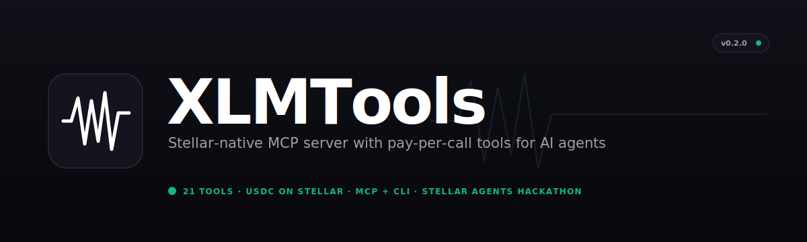
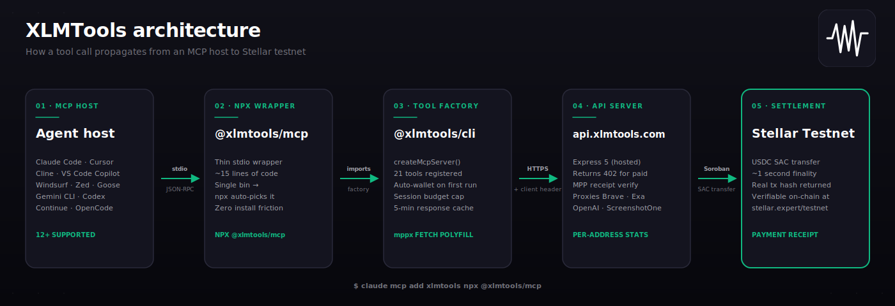

<p align="center">
  
</p>

# XLMTools

Stellar-native MCP server with pay-per-call tools for AI agents. One-line install. No subscriptions. Every payment settles on-chain.

Built for the **Stellar Hacks: Agents** hackathon (x402 / MPP track).

## Quick start

XLMTools ships in three flavours: **MCP server**, **standalone CLI**, and **cross-client Agent Skill**. Install any or all.

### MCP server

```bash
# Claude Code
claude mcp add xlmtools npx @xlmtools/mcp

# Gemini CLI
gemini mcp add xlmtools npx -y @xlmtools/mcp

# OpenAI Codex
codex mcp add xlmtools npx -y @xlmtools/mcp

# Cursor / Windsurf / Claude Desktop / VS Code / Zed / Cline / Continue / Goose
# Add to the client's MCP config:
#   { "command": "npx", "args": ["-y", "@xlmtools/mcp"] }
```

See the [MCP Host Setup guide](https://xlmtools.com/docs/guides/mcp-setup) for exact config for each of 12 clients.

### Standalone CLI

```bash
npm install -g @xlmtools/cli
xlm --help
```

### Agent Skill

```bash
# Paste into any agent
Read https://xlmtools.com/skill.md and follow the instructions to install XLMTools.

# Or via CLI
npx skills add github:Blockchain-Oracle/xlmtools --skill xlmtools
```

The skill works natively in Claude Code, Cursor 2.4+, Windsurf, VS Code Copilot, Codex CLI, Gemini CLI, Goose, and Cline.

On first run, XLMTools generates a Stellar testnet wallet, funds it with XLM via friendbot, and adds a USDC trustline — all automatically. This only happens on testnet. The only manual step is getting testnet USDC:

1. Run the install command above and make any tool call to trigger wallet setup
2. Go to [faucet.circle.com](https://faucet.circle.com), select Stellar, paste your wallet address
3. Done — all paid tools will now work

Your wallet is at `~/.xlmtools/config.json`. The secret key never leaves your machine.

Note: Auto-wallet funding (friendbot XLM + USDC trustline) only runs on testnet. On mainnet, fund your wallet manually.

## What this does

XLMTools gives AI agents access to 21 tools. Paid tools cost $0.001 to $0.04 per call in USDC via Stellar's Micropayment Protocol. Free tools have no cost. No API keys needed. No accounts to create.

Works with every major agent client (Claude Code, Claude Desktop, Cursor, Windsurf, VS Code Copilot, Gemini CLI, OpenAI Codex, Zed, Continue, Cline, Goose) and as a standalone `xlm` for direct terminal use.

## Tools

### Paid (USDC via Stellar MPP)

| Tool | Price | What it does |
| --- | --- | --- |
| search | $0.003 | Web and news search |
| research | $0.010 | Multi-source deep research with summaries |
| youtube | $0.002 | Video search and lookup |
| screenshot | $0.010 | Capture a screenshot of any URL |
| scrape | $0.002 | Extract clean text from any URL |
| image | $0.040 | AI image generation from text prompts |
| stocks | $0.001 | Real-time stock quotes |

### Free

| Tool | What it does |
| --- | --- |
| crypto | Cryptocurrency prices and market data |
| weather | Current weather for any city |
| domain | Domain availability check |
| budget | Set/check/clear session spending limits |
| wallet | Your Stellar wallet address and balance |
| tools | List all available tools and prices |
| dex-orderbook | Stellar DEX live orderbook |
| dex-candles | OHLCV candlestick data |
| dex-trades | Recent DEX trade history |
| swap-quote | Best swap path between assets |
| stellar-asset | Asset info, supply, trustlines |
| stellar-account | Account balances and signers |
| stellar-pools | Liquidity pool data |
| oracle-price | Reflector oracle prices |

## Agent Skill

XLMTools also ships as an Agent Skill — procedural instructions that teach Claude (or any skill-capable agent) when and how to use XLMTools tools. Three install methods:

```bash
# 1. Via the community skills CLI
pnpm dlx skills add github:Blockchain-Oracle/xlmtools --skill xlmtools

# 2. Via prompt — paste into any agent
Read https://xlmtools.com/skill.md and follow the instructions to install XLMTools.

# 3. Manual — copy the SKILL.md from packages/skills/xlmtools/ into ~/.claude/skills/xlmtools/
```

The skill teaches your agent the decision tree (user intent → tool), paid tool warnings, receipt handling, and CLI fallback when MCP isn't available. See [`packages/skills/xlmtools/SKILL.md`](packages/skills/xlmtools/SKILL.md) or visit `/skill` on the frontend.

## Standalone CLI

XLMTools also ships as a terminal tool. Same wallet, same payments, no MCP host needed.

```bash
npm install -g @xlmtools/cli

xlm wallet
xlm crypto bitcoin,stellar
xlm weather Lagos
xlm search "Stellar MPP" --count 5
xlm dex-orderbook XLM/USDC --limit 3
xlm --help
```

Every paid call prints a Stellar transaction hash you can verify on-chain.

## How payment works

```
You ask Claude to search for something
  -> CLI sends request to XLMTools API
  -> API returns 402 Payment Required
  -> mppx auto-builds a Soroban USDC transfer on Stellar
  -> Your local key signs it (key never leaves your machine)
  -> API verifies payment, calls the backend, returns results
  -> Response includes a Stellar transaction hash for verification
```

No manual steps. Every paid response includes a receipt:

```
Payment: $0.003 USDC · tx/8f3a1b2c... · stellar testnet
```

Verify any transaction at [stellar.expert](https://stellar.expert/explorer/testnet).

## Cost management

**Budget** — set a per-session spending cap so agents cannot overspend:

```
Set my budget to $2.00
```

Calls that would exceed the limit are blocked. Use `budget check` to see remaining balance.

**Caching** — identical queries within 5 minutes return cached results at no charge. You never pay twice for the same data.

## Architecture

<p align="center">
  
</p>

Payment is handled by two Stellar libraries working in tandem: **`@stellar/mpp`** defines the Soroban SAC USDC charge method; **`mppx`** wraps `fetch` to intercept 402 responses, build and sign the transaction, and retry transparently. Your secret key never leaves your machine.

See the [Architecture guide](https://xlmtools.com/docs/guides/architecture) for a full breakdown of the two-package split, request lifecycle, and security properties.

### Two install paths, one source of truth

XLMTools ships as **two packages** instead of one to make the install story work cleanly across every MCP host:

| Package | Bin | What you install | Purpose |
| --- | --- | --- | --- |
| [`@xlmtools/mcp`](https://npmjs.com/package/@xlmtools/mcp) | `xlmtools-mcp` | `claude mcp add xlmtools npx @xlmtools/mcp` | MCP stdio server. Thin wrapper that imports the server factory from `@xlmtools/cli`. Single bin, so `npx @xlmtools/mcp` auto-resolves. |
| [`@xlmtools/cli`](https://npmjs.com/package/@xlmtools/cli) | `xlm` | `npm install -g @xlmtools/cli` | Standalone terminal CLI. Also exports `createMcpServer()` via `main`/`types` — consumed by `@xlmtools/mcp` as a runtime dependency. |

**Why two packages?** npm/npx can't auto-resolve `npx @pkg/name` when a package has multiple bins and none matches the package tail. The ecosystem convention (`@upstash/context7-mcp`, `@magicuidesign/mcp`, `@modelcontextprotocol/server-*`) is one package per bin. Shipping the MCP as its own single-bin package is the only clean way to make `claude mcp add xlmtools npx @xlmtools/mcp` work in every host, while still giving terminal users `npm install -g @xlmtools/cli` for the `xlm` command.

## Project structure

```
packages/
  mcp/     - @xlmtools/mcp — thin stdio wrapper, published to npm
  cli/     - @xlmtools/cli — standalone `xlm` + createMcpServer() factory,
             owns all tool implementations + shared lib code, published to npm
  api/     - Express API (hosted at api.xlmtools.com)
             verifies MPP, calls backends, per-address stats
  web/     - Next.js 16 frontend (xlmtools.com)
             landing page, tools browser, Explorer live stream, Stats history
  docs/    - Nextra 4 documentation site (docs.xlmtools.com)
  skills/  - Cross-client Agent Skill (SKILL.md), distributed via skills CLI
```

## Documentation

Full documentation covering installation, all 21 tools, payment flow, MCP host setup for Claude/Cursor/Windsurf, API reference, and FAQ.

```bash
cd packages/docs && pnpm dev
```

## Docker

```bash
# 1. Copy and configure env
cp packages/api/.env.example packages/api/.env
# Edit packages/api/.env with your API keys

# 2. Run
docker compose up -d

# 3. Verify
curl http://localhost:3000/health
```

The Docker setup runs the API server only. Both the MCP (`@xlmtools/mcp`) and standalone CLI (`@xlmtools/cli`) run locally on the user's machine — spawned via `npx` or installed globally via `npm install -g`. They hit the hosted API over HTTPS.

## Development

```bash
pnpm install

# API server (needs .env with backend API keys)
pnpm dev:api

# CLI in dev mode
pnpm dev:cli

# Frontend
cd packages/web && pnpm dev

# Docs
cd packages/docs && pnpm dev
```

### Environment variables (API server only)

| Variable | Purpose |
| --- | --- |
| STELLAR_RECIPIENT | Stellar public key receiving USDC payments |
| MPP_SECRET_KEY | Random string for mppx credential verification |
| BRAVE_API_KEY | Brave Search API |
| EXA_API_KEY | Exa research API |
| YOUTUBE_API_KEY | YouTube Data API |
| SCREENSHOTONE_KEY | ScreenshotOne API |
| OPENAI_API_KEY | OpenAI (DALL-E 3) |
| ALPHA_VANTAGE_KEY | Alpha Vantage stock data |
| OPENWEATHER_API_KEY | OpenWeatherMap |

Users never configure these. They install, fund their wallet, and use tools.

## Tech stack

- TypeScript, Node.js 22+, ES modules
- @modelcontextprotocol/sdk (MCP)
- @stellar/stellar-sdk, @stellar/mpp, mppx (Stellar MPP payments)
- Express 5 (API), Next.js 16 (frontend), Nextra 4 (docs)
- Zod 4 (validation), pino (logging)
- Stellar testnet, USDC

## What makes this different

1. First MCP server on Stellar with MPP billing
2. Pay per call, not per month. No API keys for users to manage
3. 21 tools covering web, media, finance, and the full Stellar DEX
4. Response caching and budget enforcement built in
5. Every payment verifiable on-chain with a real Stellar transaction hash
6. Direct settlement via MPP charge mode on Soroban

## License

MIT
